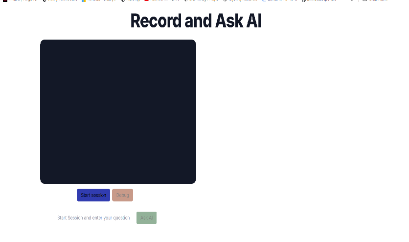

# Record and Ask

## Backend: Simple Python Server with LangChain

The BE is a simple Python server that interacts with OpenAI LLM using LangChain. The server is built using Tornado a simple python based library. The chat flow is built using LangGraph that provides the capability to built Agents that can orchestrate and delegate tasks.
This is just a simple POC, so the use case is a pretty simple and the Agents are built to only do a specific task. The BE just exposes a post API that accepts the questions and a base64 image to analyze. The Agents can configured to do the following:

1. The entry level Agent routes the user question to the other specialized agent.
2. There are 2 specialized agent, one for answering general question about the image and second to answer Sign language related questions in the image.

The files are organized as such:

1. `server.py` - This is the entry file that creates the Tornado server and defines the POST route handler that invokes the ChatBot class instance.

   ```py
   def post(self):
        global chatBot
        chatBot = chat.ChatBot()
        body = json.loads(self.request.body)
        base64Img = body.get("base64Img")
        question = body.get("question")
        result =  chatBot.invoke(base64Img, question)
        self.write({'message': result.content})

   ```

2. `chat.py` - This is where we define a ChatBot class that defines functions to interact with the graph. We invoke the LLM with a basic SystemMessage and 2 HumanMessage, one for the Image and one for the question. We have explicitly separated the HumanMessage into two because down the line in the Graph Node, we uses a orchestrator first to analyze the question and than route the question and image to the right LLM.

   ```py
   def invoke(self, base64Img, question = default_question):
      result = self.chain.invoke([
        SystemMessage(
            content=prompt,
        ),
        HumanMessage(
         content= [
            {"type": "text", "text": question},
           ],
        ),
        HumanMessage(
         content= [
            {"type": "image_url", "image_url": {"url": base64Img }}
           ],
        )
      ])

      ai_response = result[-1]
      return ai_response
   ```

3. `graph_agent.py` - This is the place where we define our workflow using LangGraph. We define the nodes and functions they will invoke. For example below is how we define the function for invoking when General Agent is called. In the function we get the `state` which is the LangGraph state and has all the messages till now and we just pluck the second last message, which is our HumanMessage that has the question and image.

   ```py
   def general_expert_node(state: Sequence[BaseMessage]) -> List[BaseMessage]:
    last_message_human = state[-2]

    res = graph_agent.generic_chain_invoke(last_message_human.content)
    print(res, "response from general_expert_node")

    return [AIMessage(content=res.content)]
   ```

We also define our Graph and its nodes and connections like so:

    ```py
    def create_graph() -> StateGraph:
      builder = MessageGraph()
      builder.add_node(ROUTER, router_node)
      builder.add_node(SIGN_EXPERT, sign_expert_node)
      builder.add_node(GENERIC_EXPERT, general_expert_node)
      builder.set_entry_point(ROUTER)
      builder.add_conditional_edges(ROUTER, should_continue)
      builder.add_edge(SIGN_EXPERT, END)
      builder.add_edge(GENERIC_EXPERT, END)

      graph = builder.compile()
    ```

4. `chain.py` - This file houses all out LLM, Prompts and Functions that are called by the Graph nodes to perform the action. For example this function is invoked by the General Agent node:

   ```py
   def generic_chain_invoke(messages):
    return llm.invoke([
        SystemMessage(
            content=generic_expert_prompt,
        ),
        HumanMessage(
         content= messages,
        ),
    ])
   ```

## FrontEnd: NextJS Based App

The frontend uses NextJS to spin up a React app with Tailwind for styling. The UI is simple and it provides the following functionality:

1. User can record a video session using his laptop's camera.
2. The App takes screenshots from the video and temporarily save them as base64 images.
3. It then let's the user ask question around the currently recorded session. It makes a call to the BE server to interact with the LLMs.
4. The user is provided with a debug button to verify if the answer actually aligns with the screenshots taken from the previous session.

There are few libs that are used in FE to accomplish this task:

- `@wmik/use-media-recorder` - Its a React based hooks to utilize the MediaRecorder API for audio, video and screen recording. We use it for video recording and capture live feed from user's camera.
- `canvas` - We are using canvas which is built in JS to take a snapshot of the live streaming video. We are running a loop that performs this process periodically.
- `merge-images` - This package allows to compose images together. So we take the last few screenshots and combine them into a single image before sending to LLM.

The files are organized as such:

1. `page.tsx` - This is the entry point which maps to the index route and loads the video chat component.
2. `video-chat.tsx` - This houses the components for Live video capturing and responses from the BE.
3. `utils.ts` - This has common utilities for image composing and getting dimensions.

## Local Development

### BE

\***\* Assuming you have python installed locally. \*\***

- First make sure you add your Open AI API key in the .env.example and rename the file to ".env".
- You can either use virtual environment or just install the deps with: `pip install -r requirements.txt`
- To run the server run `python server.py`.
- If your server crashes for any reason and the port is still occupied with the previous task, you can open command prompt and do the following commands:

1. To find the running task for a port - `netstat -ano | find "8888"`
2. For killing task for the port - `taskkill /PID <PORT NUMBER> /F`

### FE

- If you are using `nvm` as a package manager run `nvm use` to use the node version defined in the project.
- Then run `npm install` to install the deps.
- Now we can spin the local server by running `npm run dev`

#### UI




#### Cert issue with Venv

- Run the following to see where the certificate is, run it from the venv
  `pip show certifi`
- The `location` attribute will specify where the cert is located.
- Open the `cacert` file and we would need to add the Open Ai Cert to it.
- Go to the OpenAI (https://platform.openai.com) and from the navigation copy the `cert` details and paste it in the `cacert` file.
- Now we need to update the `os` path in the file as

  ```py
  import os
  os.environ['REQUESTS_CA_BUNDLE'] = "<path to cacert file>"
  ```
